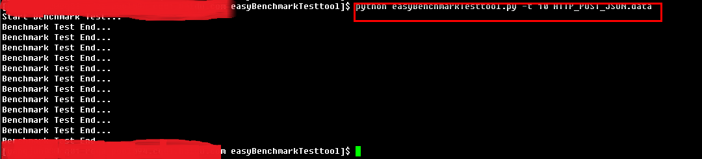
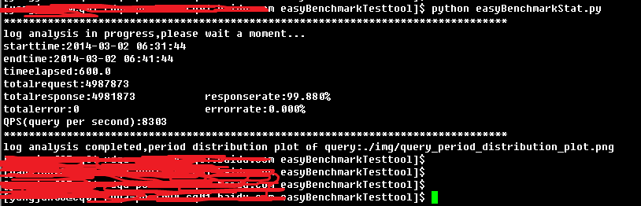

easyBenchmarkTesttool
=====================

### Introduction:
a general benchmark test tool depends on tornado's feature of high-performance framework based on epoll module,asynchronous httpclient,multi-process,and the python plotting package matplotlib,numpy for matlab 2D graphics.http protocol of get and post is supported current version,the project is still in development for the extend of gernal protocol,please pay attention to continuous update follwed-up.

### Feature:
* this client test tool could easily reach a high level of pressure with small count of CPU and memory resources.
* with a small scale of source code,extension of other protocol will be easy to achieve.
* relatively perfect output of statistics and graphics    
    
### Dependencies:
* tornado=>>http://www.tornadoweb.org/en/stable/
* matplotlib=>>http://matplotlib.org/
* numpy=>>http://www.numpy.org/

### Usage:
* easyBenchmarkTesttool.py used for benchmark test,using python easyBenchmarkTesttool.py -h for help.    
     
* easyBenchmarkStat.py used for log analysis,data statistics,and the plot of QPS.   
* consideration the output log is relatively large by default,long time stress or stablity test is not recommended with this tool,log output optional will be supported soon.

### Screenshots:    
**1.screenshot of benchmark test tool running:**
    

**2.screenshot of log analysis,data statistics:**
     

**3.plot of period distributed query:**
  

**4.test result of one http server:** 
    

**5.resource used of this tool:**  

### Kindly Reminder:
If any questions, please contact JunneYang yangjun03@baidu.com.

